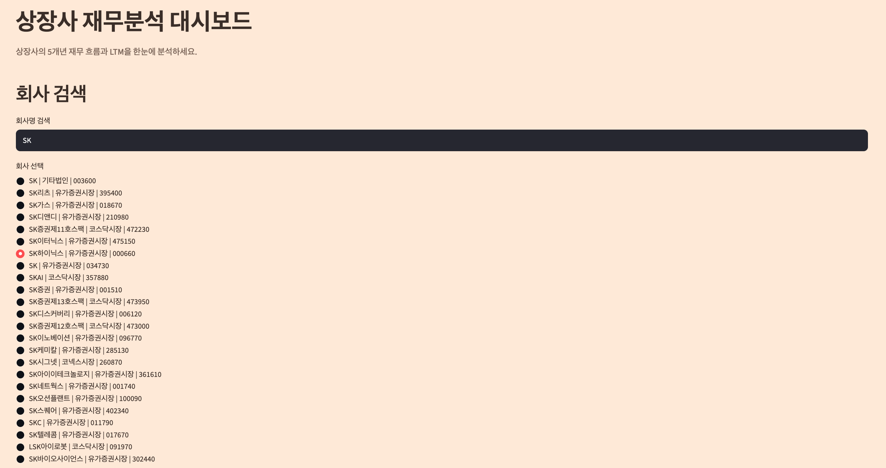
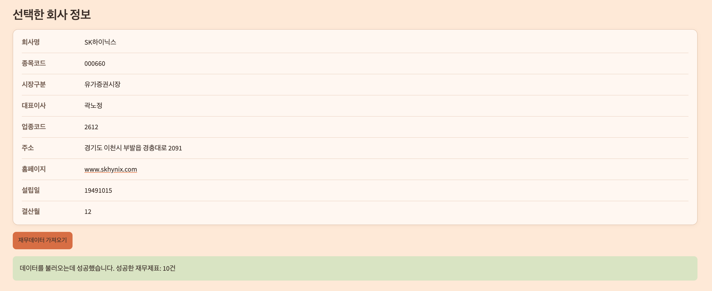
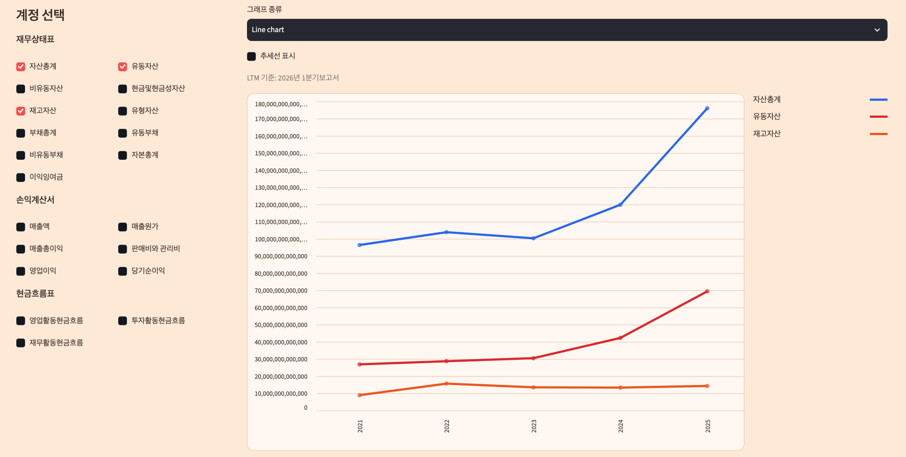
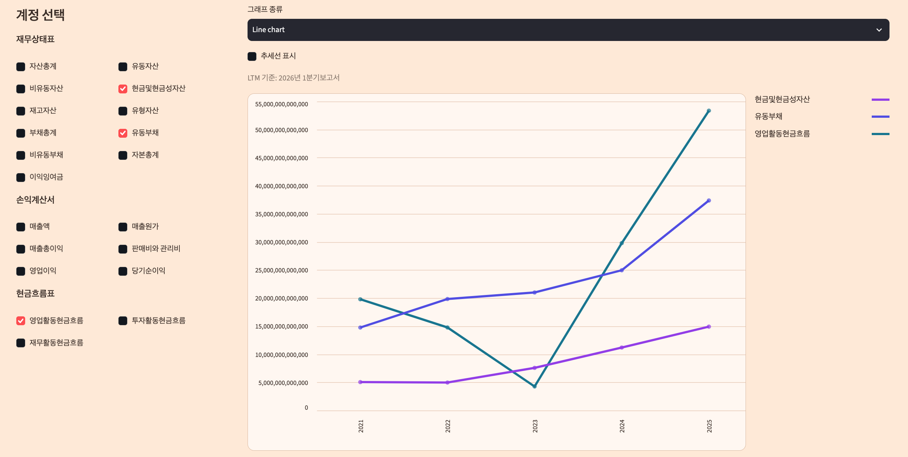
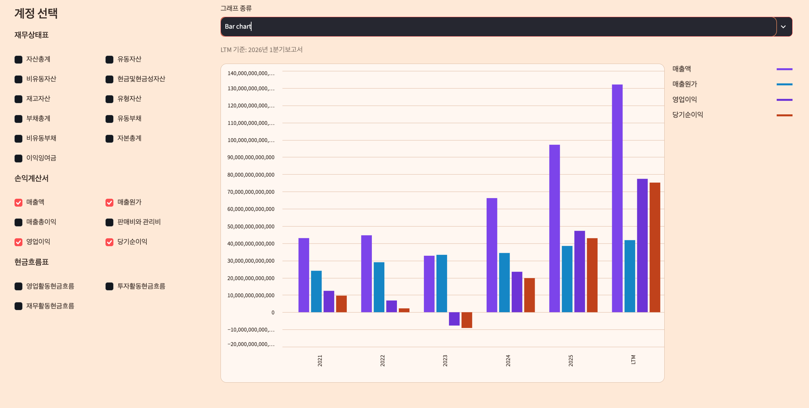

# DART Financial Dashboard

[](https://dart-financial-dashboard.streamlit.app/)

**Live Demo:** https://dart-financial-dashboard.streamlit.app/

An interactive Streamlit dashboard for analyzing five-year financial trends and LTM metrics of Korean listed companies using OpenDART financial data.

The dashboard uses XBRL-based account normalization to provide consistent financial comparisons across companies and reporting periods, even when the same economic concept is presented under different account labels.

> 한국 상장사의 최근 5개년 재무 흐름과 LTM을 한눈에 분석하는 OpenDART 기반 재무분석 대시보드입니다.

## Project Overview

Financial statements of Korean companies often use different labels for accounts with the same economic meaning, depending on the company, reporting period, and type of financial statement. For example, revenue may appear as `매출액`, `수익(매출액)`, or `영업수익`, while net income may appear as `분기순이익(손실)` or `반기순이익(손실)` in interim reports.

To reduce the limitations of Korean account-name matching, this project prioritizes XBRL `account_id` values when extracting financial data. The matching engine validates the account ID together with the permitted financial statement section and exclusion rules. For unusual taxonomy extensions or company-specific labels, exact `account_nm` matching is retained as a fallback.

This approach enables more robust financial data extraction without repeatedly patching individual Korean account-name variations.

## Key Features

- Search across 3,976 Korean listed companies
- Display company information including market classification, CEO, industry code, address, and website
- Select between consolidated financial statements (CFS) and separate financial statements (OFS)
- Retrieve financial data from the latest five annual reports
- Calculate LTM values for supported income statement accounts
- Normalize 22 standardized financial accounts using XBRL concepts
- Select and compare multiple financial accounts simultaneously
- Switch between line charts and bar charts
- Display optional linear trendlines
- Maintain stable account-specific colors and a custom legend
- Show Korean hover tooltips with comma-formatted financial amounts
- Provide a warm cream-toned light user interface

## Core Technical Design

Financial account extraction follows a two-stage matching strategy:

1. Match by `account_id` + permitted `sj_nm` + exclusion rules
2. Fall back to exact `account_nm` matching when necessary

Examples:

```text
매출액 / 수익(매출액) / 영업수익
→ ifrs-full_Revenue

당기순이익 / 분기순이익 / 반기순이익 / 분기순이익(손실)
→ ifrs-full_ProfitLoss
```

This architecture is more robust than continuously patching Korean account-label variations on a company-by-company basis.

The matching engine also validates the financial statement section (`sj_nm`) because identical or similar account names may appear across the income statement, statement of comprehensive income, cash flow statement, or other sections.

### Account ID-First Matching

The extraction priority is:

```text
XBRL account_id
        ↓
Allowed financial statement section (sj_nm)
        ↓
Exclusion rules
        ↓
Exact Korean account_nm fallback
```

This design became especially important when testing Korean Air. Revenue was presented under different Korean labels across reporting periods, causing missing values under a label-only matching approach. By resolving the account through `ifrs-full_Revenue`, the dashboard could consistently retrieve revenue across all tested years.

## LTM Calculation

LTM values are calculated using the following formula:

```text
LTM =
latest annual amount
+ current interim cumulative amount
- prior-year same-period cumulative amount from the same interim report
```

After identifying the latest valid annual report, the application searches for the latest available interim report using the following priority:

```text
Third quarter → Half year → First quarter
```

The interim report's fiscal year must be later than the latest annual report year.

LTM calculation is applied only to supported income statement accounts. LTM values displayed by this application are calculated analytical metrics and should not be interpreted as audited or forecast financial data.

## Supported Financial Accounts

The dashboard currently supports 22 standardized financial accounts.

### Statement of Financial Position

- Total Assets
- Current Assets
- Non-current Assets
- Cash and Cash Equivalents
- Trade Receivables
- Inventories
- Property, Plant and Equipment
- Intangible Assets
- Total Liabilities
- Current Liabilities
- Non-current Liabilities
- Total Equity
- Retained Earnings

### Income Statement

- Revenue
- Cost of Sales
- Gross Profit
- Selling and Administrative Expenses
- Operating Income
- Net Income

### Statement of Cash Flows

- Cash Flows from Operating Activities
- Cash Flows from Investing Activities
- Cash Flows from Financing Activities

## Data Flow

```text
OpenDART API
        ↓
Raw financial statement JSON
        ↓
XBRL account normalization
        ↓
Processed financial data
        ↓
Five-year trend and LTM calculation
        ↓
Interactive visualization
```

## Tech Stack

- Python
- Streamlit
- pandas
- Altair
- OpenDART API
- XBRL taxonomy
- python-dotenv

## Project Structure

```text
.
├── app.py
├── requirements.txt
├── README.md
├── data/
│   └── processed/
│       ├── company_list.csv
│       ├── company_master.csv
│       └── financial_statement.csv
└── src/
    ├── fetch_company_list.py
    ├── build_company_master.py
    ├── enrich_market_classification.py
    ├── fetch_financial_statement.py
    ├── extract_accounts.py
    └── reset_financial_statement.py
```

Raw JSON files under `data/raw/` are generated at runtime and are not tracked by Git.

## Screenshots











## Local Setup

### 1. Clone the repository

```bash
git clone <repository-url>
cd dart-financial-dashboard
```

### 2. Create and activate a virtual environment

```bash
python3 -m venv .venv
source .venv/bin/activate
```

### 3. Install dependencies

```bash
pip install -r requirements.txt
```

### 4. Configure the OpenDART API key

Create a `.env` file in the project root:

```text
DART_API_KEY=your_api_key
```

Never commit the actual API key to the repository.

### 5. Run the Streamlit application

```bash
streamlit run app.py
```

## Data Preparation

`company_list.csv` and `company_master.csv` are included as the base datasets required by the application.

`financial_statement.csv` serves as initial demo financial data and is updated when users retrieve additional financial data through the application.

Raw financial statement JSON files are generated under `data/raw/` when the user clicks the financial data retrieval button.

The company datasets can be rebuilt using:

```bash
python3 src/fetch_company_list.py
python3 src/build_company_master.py
python3 src/enrich_market_classification.py
```

## Live Demo

The dashboard is publicly deployed on Streamlit Community Cloud:

https://dart-financial-dashboard.streamlit.app/

## Deployment

The application is deployed on Streamlit Community Cloud.

Required configuration:

```text
Main file path: app.py
Dependencies: requirements.txt
Secret / environment variable: DART_API_KEY

The repository contains the required deployment configuration.

## Known Limitations

- Runtime file writes may be stored on ephemeral filesystems depending on the hosting platform.
- Writes to `financial_statement.csv` and raw JSON files are not concurrency-safe for simultaneous users.
- The current architecture is designed primarily for portfolio and demonstration purposes.
- Application behavior depends on OpenDART API availability, response structures, and rate limits.
- Unusual company-specific taxonomy extensions may fall outside the currently supported account normalization coverage.
- EBITDA is not implemented because reliable calculation would require a separate architecture for note-level XBRL parsing and validation.

## Problems Solved During Development

### 1. Cash Flow Account Label Variations

Samsung Electronics presented cash flow account labels with spaces, such as:

```text
영업활동 현금흐름
```

while the initial mapping expected:

```text
영업활동현금흐름
```

The matching logic was expanded to handle these variations.

### 2. Interim Net Income Label Variations

LG Electronics reported quarterly net income under labels such as:

```text
분기순이익(손실)
```

The LTM extraction logic was expanded to support quarterly and half-year net income label variations.

### 3. Revenue Label Inconsistency Across Reporting Periods

Korean Air used different Korean labels, including `매출` and `영업수익`, across reporting periods. This caused missing values under the original account-name-based matching approach.

The issue led to a structural redesign of the extraction engine around XBRL `account_id` values.

### 4. Transition to Account ID-First Architecture

Instead of repeatedly adding Korean label variations, the extraction engine now prioritizes standardized XBRL concepts such as:

```text
ifrs-full_Revenue
ifrs-full_Assets
ifrs-full_ProfitLoss
dart_OperatingIncomeLoss
```

Exact Korean account-name matching remains available only as a fallback.

### 5. Interim Report Selection for LTM

LTM calculation required a clear distinction between annual and interim reporting periods. The application therefore identifies the latest valid annual report first and then selects the latest applicable interim report from a later fiscal year.

## Future Improvements

- Database or per-session storage
- Concurrency-safe file writes and atomic updates
- Broader XBRL taxonomy coverage
- Note-level XBRL parsing
- Automated testing

## Copyright

© 2026 Yoon Seowon. All rights reserved.